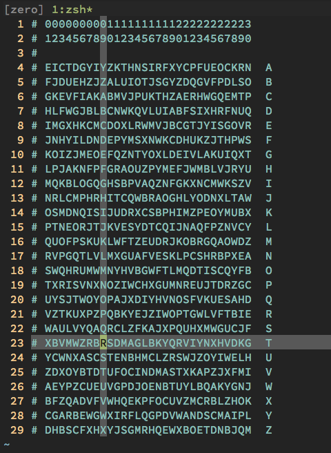

# Krypton

## 0-1

```ssh
echo S1JZUFRPTklTR1JFQVQ= | base64 -d
```

## 1-2

```sh
cd /krypton/krypton1
cat *
echo YRIRY GJB CNFFJBEQ EBGGRA | tr 'A-Z' 'N-ZA-M' # rot13.
```

## 2-3

```sh
cd /krypton/krypton2/
cat README

mkdir /tmp/ben && cd /tmp/ben
chmod 777 .
ln -s /krypton/krypton2/keyfile.dat .
echo a > t
/krypton/krypton2/encrypt t
cat ciphertext # so our a turned into an M.

# turn M back to A and continue any pattern.
cat krypton3 | tr 'M-ZA-L' 'A-Z' # it is.

# bonus:
python -c 'print( ord("a")-ord("m") )' # -12.
# this means our decryption key is -12,
# and the encryption key is 12.
```

## 3-4

```sh
cd /krypton/krypton3
cat found* | vim -
:bn # switch from scratch pad.
%s/ //g # remove spaces.

# search for repeated trigraphs.
%s/TYV//gn # 5 matches
%s/JCB//gn # 14 matches, could be the.

vim found1 # and remove spaces.
%s/JCB//gn # 10 matches, promising.

# JCB positions:
  # 133, 166, 247, 407, 530, 579, 660, 797, 1083, 1206
  # not sure, let's try a more common digraph:
# DS positions:
  # 1, 57, 201, 246, 268, 272, 276, 320, 340, 348, 359
# DS distances
  # 56, 144, 45, 22, 4, 4, 44, 20, 8
  # lots of numbers divisible by 4, might be the key length
# create a vim macro to move one char to the right, then delete 3:
qqlxxxq
# repeat it a bunch
321@q # 1285 (chars in document) / 4
# use the resulting text to perform frequency analysis.
# 38 S (11.8%)
# 28 U
# 25 B

# S in ciphertext might be an E in plaintext (very close to the 12% expected for English)
```

* I just reread the instructions and it might just *not* be a Vigenère cipher
* pretty sure I just performed a manual Kasiski test for no reason

```sh
cat found* | tr -d ' ' | fold -w1 | sort | uniq -c | sort -gr # count occurences.
# I must say, I'm pretty proud of that oneliner.
#    456 S
#    340 Q
#    301 J
#    257 U
#    246 B
#    240 N
#    227 G
#    227 C
#    210 D
#    132 Z
#    130 V
#    129 W
#     86 M
#     84 Y
#     75 T
#     71 X
#     67 K
#     64 E
#     60 L
#     55 A
#     28 F
#     19 I
#     12 O
#      4 R
#      4 H
#      2 P
```
* `S` is still the most common, and `U` and `B` are not far behind.
* reading the instructions again, it's definitely a simple substitution cipher, oh well

```sh
# S -> E
# Q -> T
# J -> A
# U -> O
# B -> I
# N -> N
# G -> S

# ETAOINS, should be easy to remember.
# let's try that
cat krypton4 | tr -d ' ' | tr 'SQJUBNG' 'etaoins'
# KeVVWiseaDeVeIeVXiMnYtooKinWCoAnMae
# not quite readable yet.

# C -> R
# D -> H
# Z -> D
# V -> L
# W -> U
# M -> C
# Y -> M
# T -> F
# X -> Y

cat krypton4 | tr -d ' ' | tr 'SQJUBNGCDYVWMYTX' 'etaoinsrhdlucmfy'
# KelluiseaheleIelyicnmtooKinuroAncae
# maybe a weird spelling of Louisiana

# I'm confident about e and ll is the most common digraph with the same two chars.
# assumem K -> W to complete the first word, K -> T or K -> H would work too
# but the respective frequencies make that less likely.

cat krypton4 | tr -d ' ' | tr 'SQJUBNGCDYVWMYTXK' 'etaoinsrhdlucmfyw'
# welluiseaheleIelyicnmtoowinuroAncae
# trigraph: `the` and `and` are very common. `the` is perfect because we are confident about e.

cat krypton4 | tr -d ' ' | tr 'SQJUBNGCDYVWMYTXK' 'etaoinsrhdlucmfyw' | grep [t,h,e] --color
# we have one potential match: `ahe` is less likely than `the` let's try that:

# switch A and T:
cat krypton4 | tr -d ' ' | tr 'SQJUBNGCDYVWMYTXK' 'eatoinsrhdlucmfyw'
# welluisetheleIelyicnmaoowinuroAncte

# let's highlight all the letters were we are reasonably sure about in red:
cat krypton4 | tr -d ' ' | tr 'SQJUBNGCDYVWMYTXK' 'eatoinsrhdlucmfyw'| grep --color [w,e,l,t,h]
# instead of adding color I'll remove the uncertain characters:
# well___ethele_el________w________te

# thele_el is probably `the level`
cat krypton4 | tr -d ' ' | tr 'SQJUBNGCDYVWMYTXKI' 'eatoinsrhdlucmfywv'| grep --color [w,e,l,t,h,v]
#  well___ethelevel________w________te

# well done?
cat krypton4 | tr -d ' ' | tr 'SQJUBNGCDYVWMYTXKI' 'eatiosnrhdldcmfywv'| \
  grep --color [w,e,l,t,h,v,d,o,n]
#  welldonethelevel_o______wo_d_____te

# we are on level three, they are probably talking about level `four`:
cat krypton4 | tr -d ' ' | tr 'SQJUBNGCDYVWMYTXKI' 'eatiornshdldumyfwv'| \
  grep --color [w,e,l,t,h,v,d,o,n,f,u,r]
# welldonethelevelfour____word___rute

# whichever word could the message be talking about? :D
cat krypton4 | tr -d ' ' | tr 'SQJUBNGCDYVWMYTXKI' 'eatsornihdldupyfwv'| \
  grep --color [w,e,l,t,h,v,d,o,n,f,u,r,p,a,s,i]
# welldonethelevelfourpasswordis_rute

# so close and yet so far!

# we could start guessing but we have other text to work with:
cat found1 | tr -d ' ' | tr 'SQJUBNGCDYVWMYTXKI' 'eatsornihdldupyfwv'| grep --color [A]
  # ... thealpha_etfor ...

# that looks like a b to me :D
cat krypton4 | tr -d ' ' | tr 'SQJUBNGCDYVWMYTXKIA' 'eatsornihdldupyfwvb'
# welldonethelevelfourpasswordisbrute

# nice, now all we have to do is uppercase it.
```

* http://practicalcryptography.com/cryptanalysis/letter-frequencies-various-languages/english-letter-frequencies/

## 4-5

* *now* we have a Vigenère cipher
* good thing I just recently had some practise...
* and we get the key length

```sh
cd /krypton/krypton4

# let's split our polyalphebetic ciphertext:
cat found1 | tr -d ' ' | fold -w1 | sed -n '1~6p' > /tmp/k4_01 # every 6th line, starting with 1.
cat found1 | tr -d ' ' | fold -w1 | sed -n '2~6p' > /tmp/k4_02
cat found1 | tr -d ' ' | fold -w1 | sed -n '3~6p' > /tmp/k4_03
cat found1 | tr -d ' ' | fold -w1 | sed -n '4~6p' > /tmp/k4_04
cat found1 | tr -d ' ' | fold -w1 | sed -n '5~6p' > /tmp/k4_05
cat found1 | tr -d ' ' | fold -w1 | sed -n '6~6p' > /tmp/k4_06

vim /tmp/k4_0{1..6} -O6 # take a look at our 6 monoalphabetic ciphertexts.

# let's analyze the first one:
cat /tmp/k4_01 | sort | uniq -c | sort -gr

#     63 S  ->   E
#     59 I  ->   T
#     55 X  ->   A
#     44 M  ->   O
#     43 J  ->   I
#     34 E  ->   N
#     30 Y  ->   S
#     29 W  ->   
#     28 V  ->   
#     28 P  ->   
#     28 L  ->   
#     27 T  ->   
#     27 R  ->   
# ...

# you know what, I'm not doing that by hand again.
```

* To save my sanity I'm going to use JCryptTool
* but first let me see if we can find the key length ourselves

```sh
# look for common trigraph: YYI looks promising (9 matches)
# could be `the` (it's also in the first position)

# lets write down the positions:
  # 1, 139, 571, 1093, 1177, 1249, 1711, 1783, 2347
# calculate distances:
  # 138, 432, 468, 522, 84, 72, 462, 72, 564
  # looks like an even keylength.
# calculate greatest common factor, which is indeed 6.
# (ignoring the possibility for false positives and multiples of six)

# let's play around with it in vim
vi found1
:%s/ //g       # remove spaces
:%!fold -w6    # align by key length
:%s/^Y/t/g    # replace all Ys in first position with ts (22)
:%s/\%2cY/h/g # replace all Ys in the second position with hs (19)
:%s/\%3cI/e/g # replace all Is in the third position with es (34)

# theCSJ
# IZeBAG
# thXRIE
# WVeXAF
# NJOOVQ
# QVHDLC
# RKLBSS
# LhXRIQ
# tIeOXQ
# ...

# quite a few possible matches already.
# but enough of that, not going down that rabbit hole.
# off to cryptool!
```

* https://www.wolframalpha.com/input/?i=greatest+common+denominator+%28138%2C+432%2C+468%2C+522%2C+84%2C+72%2C+462%2C+72%2C+564%29
* JCrypTool
  * load `found1` text into it
  * Analysis -> Vigenere Breaker -> Automated Analysis
    * password length was detected as 6
      * (bonus) Friedman test for a visual representation of the distances between patterns
    * password is `frekey`
      * (bonus) Frequency analysis -> Polyalphabetic -> key legth 6
  * the plaintext is `THESOLDIERWITHTHE...`
    * JCryptTool was successful (because the plaintext makes sense)
    * we were right, with our guess about `YYI` being `the`
  * we can use the same key to decrypt the content of the file `krypton5`
    * don't forget to remove the space

```sh
# bonus:

# compare partially decrypted text:
# theCSJ
# IZeBAG
# thXRIE

# with decrypted:
# THESOL
# DIERWI
# THTHEG

# as you can tell we only found one (of the six possible) offsets for THE!
# namely offset 1. the THE that started at offset 3 is not found
# because it uses a different chiper. (we did get partial matches though)

# we can take that knowlege and go back to search for RIE (the offset 3 THE):
# this offset only has 3 matches. of course there are 4 more possible offset!
```

## 5-6

```sh
# same thing again, search for a common trigraph.
# ZAL has 6 matches
# pos: 25, 88, 313, 664, 952, 1465
# dis: 63, 225, 351, 288, 513 (likely an uneven key)
# gcd: 9
# GNX has 6 matches -> 
# pos: 6, 348, 528, 546, 654, 1230
# dis: 342, 180, 18, 108, 576
# yep, let's go with 9.

# fold it to 9 width in vim.
# GNX are always at position 6,
# ZAL at position 7, so no false matches.

# which is lucky because because we did not have
# to eliminate any matches from our GCD calculations.
```

* https://www.wolframalpha.com/input/?i=greatest+common+denominator+%2863+225+351+288+513%29
* https://www.wolframalpha.com/input/?i=greatest+common+denominator+%2863+225+351+288+513+342+180+18+108+576%29
* same procedure with cryptool as before, pwd: `keylength`

## 6-7

* stream cipher
* we can perform a chosen plaintext attack
* let's redeem ourselves for lazily using cryptool before

```sh
mkdir /tmp/ben && cd /tmp/ben
chmod 777 . # make sure `encrypt` can access the folder.
ln -s /krypton/krypton6/keyfile.dat # link keyfile to our tmp folder.

# encrypting only one char will make the pattern more visible.
python -c 'print(3000*"A")' > plain

# read plain- and write to cipher-file:
/krypton/krypton6/encrypt plain cipher

# take a look at it and try and find a pattern.
less cipher

# that was way easier than expected.
# guesstimate the length:
cat cipher | fold -w 40 | head -n 20

# EICTDGYIYZKTHNSIRFXYCPFUEOCKRNEICTDGYIYZ
# KTHNSIRFXYCPFUEOCKRNEICTDGYIYZKTHNSIRFXY
# CPFUEOCKRNEICTDGYIYZKTHNSIRFXYCPFUEOCKRN
# EICTDGYIYZKTHNSIRFXYCPFUEOCKRNEICTDGYIYZ
# KTHNSIRFXYCPFUEOCKRNEICTDGYIYZKTHNSIRFXY
# CPFUEOCKRNEICTDGYIYZKTHNSIRFXYCPFUEOCKRN
# EICTDGYIYZKTHNSIRFXYCPFUEOCKRNEICTDGYIYZ
# KTHNSIRFXYCPFUEOCKRNEICTDGYIYZKTHNSIRFXY
# CPFUEOCKRNEICTDGYIYZKTHNSIRFXYCPFUEOCKRN
# EICTDGYIYZKTHNSIRFXYCPFUEOCKRNEICTDGYIYZ
# KTHNSIRFXYCPFUEOCKRNEICTDGYIYZKTHNSIRFXY
# CPFUEOCKRNEICTDGYIYZKTHNSIRFXYCPFUEOCKRN
# EICTDGYIYZKTHNSIRFXYCPFUEOCKRNEICTDGYIYZ
# KTHNSIRFXYCPFUEOCKRNEICTDGYIYZKTHNSIRFXY
# CPFUEOCKRNEICTDGYIYZKTHNSIRFXYCPFUEOCKRN
# EICTDGYIYZKTHNSIRFXYCPFUEOCKRNEICTDGYIYZ
# KTHNSIRFXYCPFUEOCKRNEICTDGYIYZKTHNSIRFXY
# CPFUEOCKRNEICTDGYIYZKTHNSIRFXYCPFUEOCKRN
# EICTDGYIYZKTHNSIRFXYCPFUEOCKRNEICTDGYIYZ
# KTHNSIRFXYCPFUEOCKRNEICTDGYIYZKTHNSIRFXY

# very fast repetition. we totally overshot our goal with 3000 As :D
# let's make it more visible. replace a part of the ciphertext with underscores:
cat cipher | fold -w 40 | head -n 20 | sed 's/EIC/___/g'

# ___TDGYIYZKTHNSIRFXYCPFUEOCKRN___TDGYIYZ
# KTHNSIRFXYCPFUEOCKRN___TDGYIYZKTHNSIRFXY
# CPFUEOCKRN___TDGYIYZKTHNSIRFXYCPFUEOCKRN
# ___TDGYIYZKTHNSIRFXYCPFUEOCKRN___TDGYIYZ
# KTHNSIRFXYCPFUEOCKRN___TDGYIYZKTHNSIRFXY
# CPFUEOCKRN___TDGYIYZKTHNSIRFXYCPFUEOCKRN
# ___TDGYIYZKTHNSIRFXYCPFUEOCKRN___TDGYIYZ
# KTHNSIRFXYCPFUEOCKRN___TDGYIYZKTHNSIRFXY
# CPFUEOCKRN___TDGYIYZKTHNSIRFXYCPFUEOCKRN
# ___TDGYIYZKTHNSIRFXYCPFUEOCKRN___TDGYIYZ
# KTHNSIRFXYCPFUEOCKRN___TDGYIYZKTHNSIRFXY
# CPFUEOCKRN___TDGYIYZKTHNSIRFXYCPFUEOCKRN
# ___TDGYIYZKTHNSIRFXYCPFUEOCKRN___TDGYIYZ
# KTHNSIRFXYCPFUEOCKRN___TDGYIYZKTHNSIRFXY
# CPFUEOCKRN___TDGYIYZKTHNSIRFXYCPFUEOCKRN
# ___TDGYIYZKTHNSIRFXYCPFUEOCKRN___TDGYIYZ
# KTHNSIRFXYCPFUEOCKRN___TDGYIYZKTHNSIRFXY
# CPFUEOCKRN___TDGYIYZKTHNSIRFXYCPFUEOCKRN
# ___TDGYIYZKTHNSIRFXYCPFUEOCKRN___TDGYIYZ
# KTHNSIRFXYCPFUEOCKRN___TDGYIYZKTHNSIRFXY

# our fold width guess was not too far off.
# let's count the distance and fix it:
cat cipher | fold -w 30 | head -n 20

# EICTDGYIYZKTHNSIRFXYCPFUEOCKRN
# EICTDGYIYZKTHNSIRFXYCPFUEOCKRN
# EICTDGYIYZKTHNSIRFXYCPFUEOCKRN
# EICTDGYIYZKTHNSIRFXYCPFUEOCKRN
# EICTDGYIYZKTHNSIRFXYCPFUEOCKRN
# EICTDGYIYZKTHNSIRFXYCPFUEOCKRN
# EICTDGYIYZKTHNSIRFXYCPFUEOCKRN
# EICTDGYIYZKTHNSIRFXYCPFUEOCKRN
# EICTDGYIYZKTHNSIRFXYCPFUEOCKRN
# EICTDGYIYZKTHNSIRFXYCPFUEOCKRN
# EICTDGYIYZKTHNSIRFXYCPFUEOCKRN
# EICTDGYIYZKTHNSIRFXYCPFUEOCKRN
# EICTDGYIYZKTHNSIRFXYCPFUEOCKRN
# EICTDGYIYZKTHNSIRFXYCPFUEOCKRN
# EICTDGYIYZKTHNSIRFXYCPFUEOCKRN
# EICTDGYIYZKTHNSIRFXYCPFUEOCKRN
# EICTDGYIYZKTHNSIRFXYCPFUEOCKRN
# EICTDGYIYZKTHNSIRFXYCPFUEOCKRN
# EICTDGYIYZKTHNSIRFXYCPFUEOCKRN
# EICTDGYIYZKTHNSIRFXYCPFUEOCKRN

# so our keylength is 20.

# make sure the RNG always produces the same output:
/krypton/krypton6/encrypt plain cipher2

diff ciph* # identical.

for c in {A..Z}; do printf "$c%.0s" {1..30}; echo ;done > table
cat table

# AAAAAAAAAAAAAAAAAAAAAAAAAAAAAA
# BBBBBBBBBBBBBBBBBBBBBBBBBBBBBB
# CCCCCCCCCCCCCCCCCCCCCCCCCCCCCC
# DDDDDDDDDDDDDDDDDDDDDDDDDDDDDD
# EEEEEEEEEEEEEEEEEEEEEEEEEEEEEE
# FFFFFFFFFFFFFFFFFFFFFFFFFFFFFF
# GGGGGGGGGGGGGGGGGGGGGGGGGGGGGG
# HHHHHHHHHHHHHHHHHHHHHHHHHHHHHH
# IIIIIIIIIIIIIIIIIIIIIIIIIIIIII
# JJJJJJJJJJJJJJJJJJJJJJJJJJJJJJ
# KKKKKKKKKKKKKKKKKKKKKKKKKKKKKK
# LLLLLLLLLLLLLLLLLLLLLLLLLLLLLL
# MMMMMMMMMMMMMMMMMMMMMMMMMMMMMM
# NNNNNNNNNNNNNNNNNNNNNNNNNNNNNN
# OOOOOOOOOOOOOOOOOOOOOOOOOOOOOO
# PPPPPPPPPPPPPPPPPPPPPPPPPPPPPP
# QQQQQQQQQQQQQQQQQQQQQQQQQQQQQQ
# RRRRRRRRRRRRRRRRRRRRRRRRRRRRRR
# SSSSSSSSSSSSSSSSSSSSSSSSSSSSSS
# TTTTTTTTTTTTTTTTTTTTTTTTTTTTTT
# UUUUUUUUUUUUUUUUUUUUUUUUUUUUUU
# VVVVVVVVVVVVVVVVVVVVVVVVVVVVVV
# WWWWWWWWWWWWWWWWWWWWWWWWWWWWWW
# XXXXXXXXXXXXXXXXXXXXXXXXXXXXXX
# YYYYYYYYYYYYYYYYYYYYYYYYYYYYYY
# ZZZZZZZZZZZZZZZZZZZZZZZZZZZZZZ

# let's encrypt that:

/krypton/krypton6/encrypt6 table table_c
cat table_c | fold -w 30

# 000000000111111111122222222223
# 123456789012345678901234567890
#
# EICTDGYIYZKTHNSIRFXYCPFUEOCKRN   A
# FJDUEHZJZALUIOTJSGYZDQGVFPDLSO   B
# GKEVFIAKABMVJPUKTHZAERHWGQEMTP   C
# HLFWGJBLBCNWKQVLUIABFSIXHRFNUQ   D
# IMGXHKCMCDOXLRWMVJBCGTJYISGOVR   E
# JNHYILDNDEPYMSXNWKCDHUKZJTHPWS   F
# KOIZJMEOEFQZNTYOXLDEIVLAKUIQXT   G
# LPJAKNFPFGRAOUZPYMEFJWMBLVJRYU   H
# MQKBLOGQGHSBPVAQZNFGKXNCMWKSZV   I
# NRLCMPHRHITCQWBRAOGHLYODNXLTAW   J
# OSMDNQISIJUDRXCSBPHIMZPEOYMUBX   K
# PTNEORJTJKVESYDTCQIJNAQFPZNVCY   L
# QUOFPSKUKLWFTZEUDRJKOBRGQAOWDZ   M
# RVPGQTLVLMXGUAFVESKLPCSHRBPXEA   N
# SWQHRUMWMNYHVBGWFTLMQDTISCQYFB   O
# TXRISVNXNOZIWCHXGUMNREUJTDRZGC   P
# UYSJTWOYOPAJXDIYHVNOSFVKUESAHD   Q
# VZTKUXPZPQBKYEJZIWOPTGWLVFTBIE   R
# WAULVYQAQRCLZFKAJXPQUHXMWGUCJF   S
# XBVMWZRBRSDMAGLBKYQRVIYNXHVDKG   T
# YCWNXASCSTENBHMCLZRSWJZOYIWELH   U
# ZDXOYBTDTUFOCINDMASTXKAPZJXFMI   V
# AEYPZCUEUVGPDJOENBTUYLBQAKYGNJ   W
# BFZQADVFVWHQEKPFOCUVZMCRBLZHOK   X
# CGARBEWGWXIRFLQGPDVWANDSCMAIPL   Y
# DHBSCFXHXYJSGMRHQEWXBOETDNBJQM   Z

# I have added labes with vim.
# we can use this table to decode our message.
# tip: use vim with a crosshair cursor!
# :set cursorline cursorcolumn

# you might have noticed that each letter is simply rotated.

# look for the encrypted character in the corresponding position
# in the table and read off the encrypted char from the right.

cat /krypton/krypton6/krypton7
# PNUKLYLWRQKGKBE
# LFSRISNOTRANDOM
```

* no cryptool neccessary :D

> crosshair.png
>
> </img>
